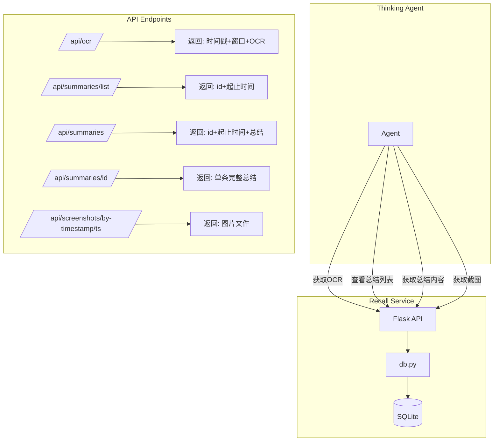

# Recall API 改进计划

## 概述

完善 recall 模块的 API 接口，使其更好地支持 thinking agent 的屏幕记忆功能。

## 现有架构分析

### 核心文件
- [`recall/web/app.py`](recall/web/app.py) - Flask API 服务
- [`recall/db.py`](recall/db.py) - SQLite 数据库操作层

### 现有 API 接口
| 接口 | 方法 | 功能 |
|------|------|------|
| `/api/recent` | GET | 获取最近截图的 OCR 摘要列表 |
| `/api/search` | GET | 搜索截图 |
| `/api/screenshot/<id>/detail` | GET | 获取单条截图完整信息 |
| `/api/screenshot/<id>/image` | GET | 获取截图图片 |
| `/api/summaries` | POST | 写入摘要 |
| `/api/summaries` | GET | 查询最近 N 小时的摘要 |
| `/screenshots/<path>` | GET | 提供截图文件 |

---

## 改进方案

### 1. OCR 文本获取接口改进

**需求**：获取 OCR 文本时，每条数据包括：时间戳、窗口、OCR 内容

**修改接口**：`GET /api/ocr`

**Query Parameters**:
- `start_time`: ISO8601 时间戳，起始时间
- `end_time`: ISO8601 时间戳，结束时间
- `limit`: 可选，最多返回条数，默认 100

**返回格式**:
```json
{
  "data": [
    {
      "id": 123,
      "timestamp": "2026-02-10T20:00:00",
      "window_title": "recall - Visual Studio Code",
      "process_name": "Code.exe",
      "ocr_text": "完整的OCR文本内容..."
    }
  ],
  "count": 1,
  "server_time": "2026-02-10T20:05:00"
}
```

**实现要点**:
- 新增路由 `/api/ocr`
- 查询 `screenshots` 表，返回完整 OCR 文本
- 支持时间范围过滤

---

### 2. 新增：列出时段内总结的起止时间

**需求**：列出当前时段内已经存在的总结起止时间，用于查看是否存在总结，不返回具体总结内容

**新接口**：`GET /api/summaries/list`

**Query Parameters**:
- `start_time`: ISO8601 时间戳，起始时间
- `end_time`: ISO8601 时间戳，结束时间

**返回格式**:
```json
{
  "summaries": [
    {
      "id": 1,
      "start_time": "2026-02-10T19:00:00",
      "end_time": "2026-02-10T20:00:00"
    },
    {
      "id": 2,
      "start_time": "2026-02-10T18:00:00",
      "end_time": "2026-02-10T19:00:00"
    }
  ],
  "count": 2
}
```

**实现要点**:
- 新增路由 `/api/summaries/list`
- 查询 `summaries` 表，只返回 id 和时间范围
- 筛选条件：总结的时间范围与请求的时间范围有交集

---

### 3. 获取总结逻辑改进

#### 方式1：按时间范围查询

**修改接口**：`GET /api/summaries`

**Query Parameters**:
- `start_time`: ISO8601 时间戳，起始时间（可选）
- `end_time`: ISO8601 时间戳，结束时间（可选）
- `hours`: 往前查询多少小时（可选，默认 24，与 start_time/end_time 互斥）

**返回格式**:
```json
{
  "summaries": [
    {
      "id": 1,
      "start_time": "2026-02-10T19:00:00",
      "end_time": "2026-02-10T20:00:00",
      "summary": "用户在这段时间内在 VS Code 中开发 recall 功能..."
    }
  ],
  "count": 1
}
```

**实现要点**:
- 如果提供 `start_time` 和 `end_time`，返回起点终点均位于该范围内的总结
- 否则使用 `hours` 参数查询最近 N 小时

#### 方式2：按 ID 获取单条总结

**新接口**：`GET /api/summaries/<int:id>`

**返回格式**:
```json
{
  "id": 1,
  "start_time": "2026-02-10T19:00:00",
  "end_time": "2026-02-10T20:00:00",
  "summary": "用户在这段时间内在 VS Code 中开发 recall 功能...",
  "activity_type": "development",
  "created_at": "2026-02-10T20:05:00"
}
```

**实现要点**:
- 新增路由 `/api/summaries/<int:id>`
- 按 ID 查询单条记录

---

### 4. Web Fetch 图片路径

**需求**：web fetch 获取图片时，路径为 `api/screenshots/<时间戳>`，便于 agent 精准定位

**新接口**：`GET /api/screenshots/by-timestamp/<timestamp>`

**Path Parameters**:
- `timestamp`: ISO8601 时间戳或时间戳数字

**返回格式**:
- 直接返回图片文件（与 `/api/screenshot/<id>/image` 相同）

**示例**:
```
GET /api/screenshots/by-timestamp/2026-02-10T20:00:00
GET /api/screenshots/by-timestamp/1739193600
```

**实现要点**:
- 新增路由 `/api/screenshots/by-timestamp/<timestamp>`
- 支持多种时间戳格式解析
- 查找最接近该时间戳的截图

---

### 5. Thinking Agent 使用文档

**文件位置**：`recall/doc/RECALL_AGENT_GUIDE.md`

**内容要点**:
1. Recall 服务概述
2. 可用 API 接口列表
3. 各接口的使用示例
4. 典型工作流程
5. 最佳实践

---

## 数据库层修改

### db.py 新增方法

```python
def get_ocr_by_time_range(start_time: str, end_time: str, limit: int = 100) -> List[Dict]:
    """获取指定时间范围内的 OCR 数据"""
    pass

def get_summary_list_by_time_range(start_time: str, end_time: str) -> List[Dict]:
    """获取指定时间范围内的总结列表（不含内容）"""
    pass

def get_summaries_by_time_range(start_time: str, end_time: str) -> List[Dict]:
    """获取指定时间范围内的总结（含内容）"""
    pass

def get_summary_by_id(summary_id: int) -> Optional[Dict]:
    """按 ID 获取单条总结"""
    pass

def get_screenshot_by_timestamp(timestamp: str) -> Optional[Dict]:
    """按时间戳获取最接近的截图"""
    pass
```

---

## API 接口汇总

| 接口 | 方法 | 功能 | 状态 |
|------|------|------|------|
| `/api/ocr` | GET | 获取时间范围内的 OCR 数据（时间戳、窗口、内容） | 新增 |
| `/api/summaries/list` | GET | 列出时段内的总结起止时间 | 新增 |
| `/api/summaries` | GET | 按时间范围获取总结（含内容） | 修改 |
| `/api/summaries/<id>` | GET | 按 ID 获取单条总结 | 新增 |
| `/api/screenshots/by-timestamp/<ts>` | GET | 按时间戳获取截图 | 新增 |

---

## 实现顺序

1. 修改 `db.py`，添加新的数据库查询方法
2. 修改 `web/app.py`，添加新的 API 路由
3. 编写单元测试
4. 编写 Thinking Agent 使用文档
5. 测试完整工作流程

---

## Mermaid 架构图


